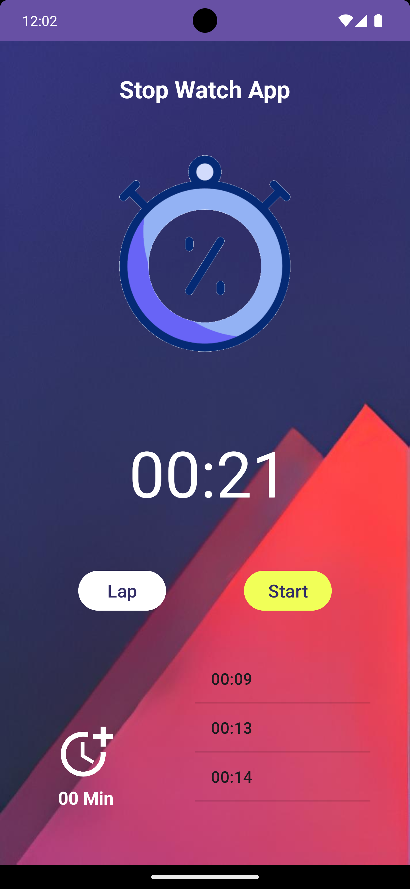
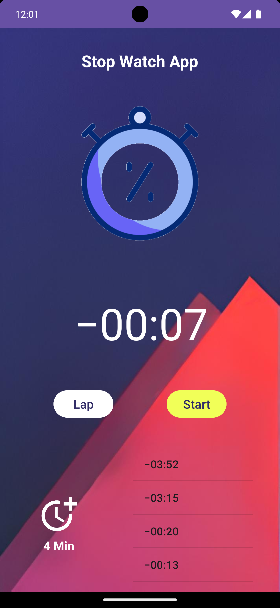
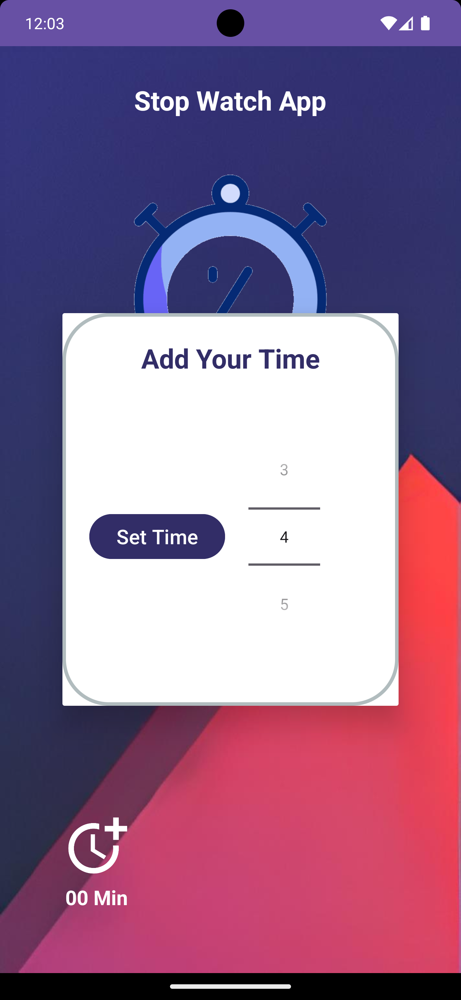

# Android_StopWatchApp_With_Kotlin_And_XML_Design
**Project Overview**
The Stopwatch app is a simple and intuitive tool for measuring elapsed time. It provides basic stopwatch features such as start, stop, and reset buttons, as well as the ability to record and display lap times.
**Screen Shots**

**Features**
* Start, stop, and reset buttons
* Lap time recording and display
* Clean and user-friendly UI
* Responsive design for different devices
  **Implementation Details**
  The app is built using Kotlin with XML design for the UI. It uses an in-memory data structure to keep track of the elapsed time and lap times.
  **Testing**
  The app has been thoroughly tested using unit tests, integration tests, and user acceptance testing to ensure its functionality and reliability.
  **Deployment**
  The app is available for download on the Google Play Store.
  **Usage**
  To use the app, simply tap the start button to begin timing. Tap the lap button to record a lap time. Tap the stop button to stop the stopwatch. Tap the reset button to reset the stopwatch.
  **Feedback**
  We welcome your feedback on the Stopwatch app. Please feel free to contact us with any suggestions or bug reports.